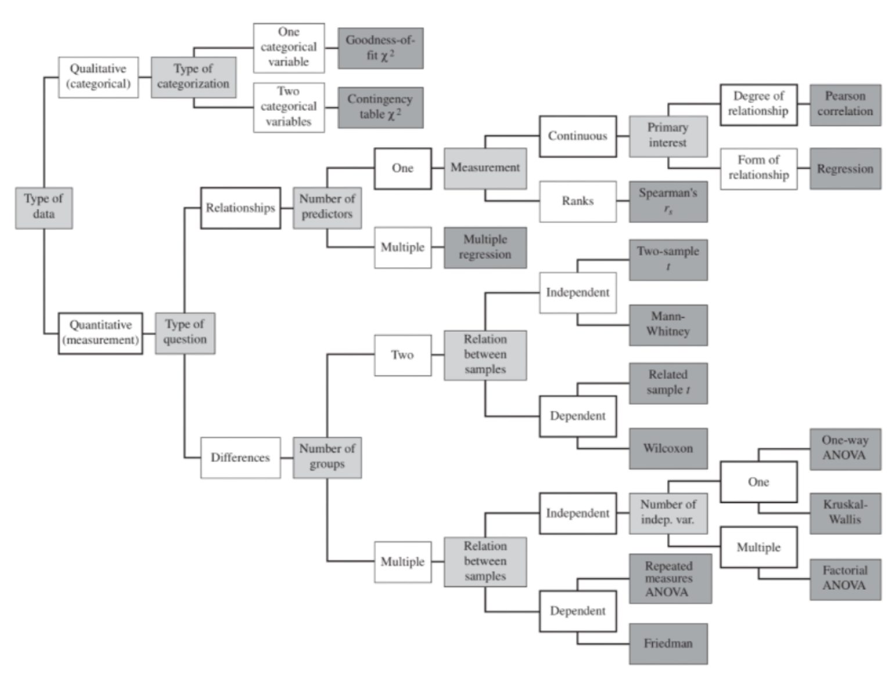

## Logistics

* Project M1 dues TODAY
* Schedule debriefing meetings with your TA mentor, before next Tuesday
* Midterm exam next week (10/9), regular time and place for lectures, see `#announcements` for details
    - Questions based on shared scenario, apply concepts
    - All lectures and readings in scope, focus on concepts with opportunity to practice (e.g., recitations, homeworks, in-class exercises)
    - Closed book, but 6 sheets of notes (sorry, no ChatGPT)
    - Lab for next week (10/11) is cancelled

---

<div class="tweet" data-src="https://twitter.com/changelog/status/1137359428632621060"></div>


---
## Back to QA...


<!-- .element: class="plain stretch" -->


----
## Learning Goals

* Design telemetry for evaluation in practice
* Understand the rationale for beta tests and chaos experiments
* Plan and execute experiments (chaos, A/B, shadow releases, ...) in production
* Conduct and evaluate multiple concurrent A/B tests in a system
* Perform canary releases
* Examine experimental results with statistical rigor
* Support data scientists with monitoring platforms providing insights from production data

----
## Readings


Required Reading: 
* Hulten, Geoff. "[Building Intelligent Systems: A Guide to Machine Learning Engineering.](https://www.buildingintelligentsystems.com/)" Apress, 2018, Chapters 14 and 15 (Intelligence Management and Intelligent Telemetry).

Suggested Readings: 
* Alec Warner and Štěpán Davidovič. "[Canary Releases](https://landing.google.com/sre/workbook/chapters/canarying-releases/)." in [The Site Reliability Workbook](https://landing.google.com/sre/books/), O'Reilly 2018
* Kohavi, Ron, Diane Tang, and Ya Xu. "[Trustworthy Online Controlled Experiments: A Practical Guide to A/B Testing](https://bookshop.org/books/trustworthy-online-controlled-experiments-a-practical-guide-to-a-b-testing/9781108724265)." Cambridge University Press, 2020.


---
# From Unit Tests to Testing in Production

*(in traditional software systems)*

----
## Unit Test, Integration Tests, System Tests

These are all testing *before* deployment --- Manual or automated


<!-- .element: class="plain" style="width:1100px" -->


Note: Testing before release. Manual or automated.

----
## Beta Testing: Move towards testing-during-deployment

Early release to select users, asking them to send feedback or report issues. 


<!-- .element: class="stretch" -->


Note: Early release to select users, asking them to send feedback or report issues. No telemetry in early days.

----
## Crash Telemetry: "Bugs" in Production

<div class="smallish">

* **Telementry**: The automated collection, transmission, and analysis of data about the performance, behavior, and usage of an application or system in real time.
* With internet availability, send crash reports home to identify problems "in production". 

</div>
 
<!-- .element: style="width:600px" -->


---
# Model Assessment in Production

Ultimate held-out evaluation data: Unseen real user data

----
## Recap: Limitations of Offline Model Evaluation

Training and test data drawn from the same population 
* **i.i.d.: independent and identically distributed**
* leakage and overfitting problems quite common

Is the population representative of production data?
* If not or only partially or not anymore: Does the model generalize beyond training data?


----
## Model Assessment in Production 

Live observation in the running system

Need **telemetry** to evaluate quality --- automated collection and monitoring of data on model performance, data quality, and user behavior to ensure continuous model accuracy, detect drift, and maintain system health in real-time.


----
## Discuss how to collect data

How do you gather data without being intrusive (i.e., labeling outcomes), without harming user experience?

<div class="small">

* Was the house price predicted correctly?
* Was the ranking of search results good?
* Did the profanity filter remove the right blog comments?
* Was there cancer in the image?
* Was a Spotify playlist good?
* Was the weather prediction good?
* Was the translation correct?
* Did the self-driving car break at the right moment? Did it detect the pedestriants?

</div>

<!-- discussion -->

Notes: More:
* SmartHome: Does it automatically turn of the lights/lock the doors/close the window at the right time?
* Profanity filter: Does it block the right blog comments?
* News website: Does it pick the headline alternative that attracts a user’s attention most?
* Autonomous vehicles: Does it detect pedestrians in the street?


----
## Telemetry strategy: Manually Label Production Samples

Similar to labeling learning and testing data, have human annotators


----
## Telemetry strategy: Explicit Report

Expect only sparse feedback and expect negative feedback over-proportionally


<!-- colstart -->

<!-- col -->

<!-- colend -->


Notes:
Expect only sparse feedback and expect negative feedback over-proportionally


----
## Telemetry strategy: Implicit Feedback

Collect user editing ("human-AI collaboration"); Can have indicators for low confidence predictions 
<!-- .element:  style="width:1100px" -->

Notes: Clever UI design allows users to edit transcripts. UI already highlights low-confidence words, can 


----
## Telemetry strategy: Wait-and-See (Retrospective) 

<!-- .element:  style="width:840px" -->

Notes: Can just wait 7 days to see actual outcome for all predictions

----
## Summary: Telemetry Strategies

* Manual/crowd-source labeling on production samples
* Explicit report: Ask users or allow users to complain
* Observe user reaction (implicit feedback)
* Wait and see

Ordered by -- How much efforts needed


----
## Measuring Model Quality with Telemetry

<div class="smallish">

**Three steps, again on measurements: (1) Metric, (2) data collection (telemetry), (3) operationalization**

* Telemetry can provide insights for correctness
    - sometimes very accurate labels for real unseen data
    - sometimes only mistakes
    - sometimes delayed
    - often just samples
    - often just weak proxies for correctness
* Often sufficient to *approximate* precision/recall or other model-quality measures
* Mismatch to (static) evaluation set may indicate stale or unrepresentative data
* Trend analysis can provide insights even for inaccurate proxy measures
</div>


----
## Breakout: Design Telemetry in Production

<div class="smallish">

Discuss how to collect telemetry (manual/crowd-source labeling, wait and see, ask users, observe user reaction), the metric to monitor, and how to operationalize. Scenarios:
* Front-left: Amazon: Shopping app detects the shoe brand from photos
* Front-right: Google: Tagging uploaded photos with friends' names
* Back-left: Spotify: Recommended personalized playlists
* Back-right: Wordpress: Profanity filter to moderate blog posts

As a group post to `#lecture` and tag team members:
> * Quality metric:
> * Data to collect:
> * Operationalization:

</div>

Notes: about 30 minutes to here

----
## Monitoring Model Quality in Production

<div class="smallish">

* Monitor model quality together with other quality attributes (e.g., uptime, response time, load)
* Set up automatic alerts...
    - when model quality drops
    - Watch for jumps after releases (roll back after negative jump)
    - Watch for slow degradation (Stale models, data drift, feedback loops, adversaries)
* Debug common or important problems
    - Monitor characteristics of requests 
    - Mistakes uniform across populations?
    - Challenging problems -> refine training, add regression tests

</div>

----
## Monitoring services: Prometheus and Grafana

[](https://prometheus.io/docs/introduction/overview/)
<!-- .element:  class="stretch" -->

----
## Grafana screenshot from Movie Recommendation Service

<!-- .element:  style="width:1200px" -->
<!-- .element:  class="stretch" -->

----
## Many commercial solutions

[](https://www.datarobot.com/platform/mlops/)
<!-- .element:  class="stretch" -->

<!-- references_ -->
e.g. https://www.datarobot.com/platform/mlops/

Many pointers: Ori Cohen "[Monitor! Stop Being A Blind Data-Scientist.](https://towardsdatascience.com/monitor-stop-being-a-blind-data-scientist-ac915286075f)" Blog 2019


----
## Many different monitoring possiblities, e.g. Detecting Drift

<!-- colstart -->

<div class="small">

Deploy monitoring at...

Training data
- Schema & distribution of incoming data
- Distribution of labels

Requests & predictions
- Schema & distribution of requests
- Distribution of predictions
- Quality of predictions

</div>

<!-- col -->

<!-- .element:  style="width:1400px" -->

<!-- colend -->

<!-- references -->
Image source: Joel Thomas and Clemens Mewald. [Productionizing Machine Learning: From Deployment to Drift Detection](https://databricks.com/blog/2019/09/18/productionizing-machine-learning-from-deployment-to-drift-detection.html). Databricks Blog, 2019


----
## Monitoring without Ground Truth: Invariants/Assertions to Assure with Telemetry

<div class="small">

* Consistency between multiple sources 
    * e.g., multiple models agree, multiple sensors agree
    * e.g., text and image agree
* Physical domain knowledge 
    * e.g., cars in video shall not flicker, 
    * e.g., earthquakes should appear in sensors grouped by geography
* Domain knowledge about unlikely events
    - e.g., unlikely to have 3 cars in same location
* Stability 
    * e.g., object detection should not change with video noise
* Input conforms to schema (e.g. boolean features)
* And all invariants from model quality lecture, including capabilities

</div>


----
## Telemetry for Training: The ML Flywheel


<!-- .element: class="plain stretch" -->

 <!-- references_ -->

 graphic by [CBInsights](https://www.cbinsights.com/research/team-blog/data-network-effects/)


----
## Engineering Challenges for Telemetry

<!-- colstart -->

<div class="smallish">

* Data volume and operating cost
    - e.g., record "all AR live translations"?
    - reduce data through sampling
    - reduce data through summarization (e.g., extracted features rather than raw data; extraction client vs server side)
* Isolating feedback for specific ML component + version
* Biased sampling / Rare events
* Privacy (related: Offline deployments)

</div>

<!-- col -->


<!-- colend -->

----
## Breakout: Engineering Challenges in Telemetry

Discuss: Cost, privacy, rare events, bias

Scenarios:
* Front-left: Amazon: Shopping app feature that detects the shoe brand from photos
* Front-right: Google: Tagging uploaded photos with friends' names
* Back-left: Spotify: Recommended personalized playlists
* Back-right: Wordpress: Profanity filter to moderate blog posts


(can update slack, but not needed)


---
# Revisiting Model Quality vs System Goals

----
## Model Quality vs System Goals

Telemetry can approximate model accuracy

Telemetry can directly measure system qualities, leading indicators, user outcomes
- define measures for "key performance indicators"
- clicks, buys, signups, engagement time, ratings
- operationalize with telemetry

----
## Model Quality vs System Quality: Booking.com

<!-- colstart -->

What's the system goal?

<!-- col -->


<!-- .element: class="stretch" -->

<!-- colend -->

Notes: The conversion rate is a key performance metric used to measure the effectiveness of marketing efforts, advertising campaigns, or sales processes. It represents the percentage of users or visitors who complete a desired action (a "conversion") out of the total number of users who were exposed to an offer, website, or advertisement.

<!-- references_ -->
Bernardi, Lucas, et al. "150 successful machine learning models: 6 lessons learned at Booking.com." In Proc. Int'l Conf. Knowledge Discovery & Data Mining, 2019.

----
## Possible causes of model vs system conflict?

<!-- colstart -->

<div class="smallish">

Observed no correlation between offline performance gain vs. business value gain, across many different models with different goals. 

Possible reasons:
- Value Performance Saturation
- Uncanny Valley effect *(e.g., "creepy AIs")*
- Proxy Over-optimization *(e.g., click-through rate approximating conversion)*

</div>

<!-- col -->


<!-- .element: class="stretch" --> 

<!-- colend -->


<!-- references_ -->

Bernardi, Lucas, et al. "150 successful machine learning models: 6 lessons learned at Booking.com." In Proc. Int'l Conf. Knowledge Discovery & Data Mining, 2019.


Note: hypothesized 
* model value saturated, little more value to be expected
* segment saturation: only very few users benefit from further improvement
* overoptimization on proxy metrics not real target metrics
* uncanny valley effect from "creepy AIs"

----
## Design Telemetry in Production

Discuss: What key performance indicator of the *system* to collect?

Scenarios:
* Front-left: Amazon: Shopping app feature that detects the shoe brand from photos
* Front-right: Google: Tagging uploaded photos with friends' names
* Back-left: Spotify: Recommended personalized playlists
* Back-right: Wordpress: Profanity filter to moderate blog posts

---
# Experimenting in Production

* A/B experiments
* Shadow releases / traffic teeing
* Blue/green deployment
* Canary releases
* Chaos experiments


----
<div class="tweet" data-src="https://twitter.com/Grady_Booch/status/1620720537805922306"></div>

----
## A/B Experiments: What if...?

<div class="smallish">

* ... we hand plenty of subjects for experiments
* ... we could randomly assign to treatment/ control group without them knowing
* ... we could analyze small individual changes and keep everything else constant

</div>

<!-- .element:  style="width:1100px" -->

<!-- colend -->

Notes: Usage observable online, telemetry allows testing in production.  Picture source: https://www.designforfounders.com/ab-testing-examples/


----
## Bing Experiment

<!-- colstart -->


<!-- col -->

<div class="small">

* Experiment: Ad Display at Bing
* Suggestion deprioritized and left in the backlog for over 6 months
* Implemented & A/B tested in production
* Within 2h *revenue-too-high* alarm triggered. 
    - Typically suggest serious bug (e.g., double billing)
    - But valid here: Revenue increase by 12% - $100M anually in US
    - Did not hurt user-experience metrics
* Simple adjustment became one of the most profitable ideas in Bing’s history!

</div>

<div class="small">

From: Kohavi, Ron, Diane Tang, and Ya Xu. "[Trustworthy Online Controlled Experiments: A Practical Guide to A/B Testing](https://bookshop.org/books/trustworthy-online-controlled-experiments-a-practical-guide-to-a-b-testing/9781108724265)."  2020.

</div>
<!-- colend -->


----
## A/B Experiment for ML Components?

* New product recommendation algorithm for web store?
* New language model in audio transcription service?
* New (offline) model to detect falls on smart watch?

<!-- discussion -->

----

## Implementing A/B Testing

Implement alternative versions of the system
* using feature flags (decisions in implementation)
* separate deployments (decision in router/load balancer)

Map users to treatment group
* Randomly from distribution
* Static user - group mapping
* Online service (e.g., [launchdarkly](https://launchdarkly.com/), [split](https://www.split.io/))

Monitor outcomes *per group*
* Telemetry, sales, time on site, server load, crash rate

Note: divide them into groups 

----
## Feature Flags (Boolean flags)

<div class="smallish">

```java
if (features.enabled(userId, "one_click_checkout")) {
     // new one click checkout function
} else {
     // old checkout functionality
}
```

* Good practices: tracked explicitly, documented, keep them localized and independent
* External mapping of flags to customers, who should see what configuration
    * e.g., 1% of users sees `one_click_checkout`, but always the same users; or 50% of beta-users and 90% of developers and 0.1% of all users

```scala
def isEnabled(user): Boolean = (hash(user.id) % 100) < 10
```

</div>

Note: mapping somewhere One way of doing this randomly is hashing user ID
random but stable
same users always in the same group
some offset to get a new sample
for telemetry you need to know what group a user was in.
Once you have a mapping from flags here then it's easier
you can also use a load balancer to manage this you need an if statement somewhere
chrome, facebook, if statements are in the backend/code

----
## Feature Flags as a Service


<!-- .element: class="stretch" --> 


Notes:
There are companies that do this as a service
exposre your database. 
"boolean option as a service"
most groups in the past have done it themselves

launch darkley, pslit IO, open source libraries 
gets complicated when you want to do multiple experiments, factorial design gets complicated
the bing team wrote a whole book


----
## Confidence in A/B Experiments (statistical tests)

<!-- colstart -->
**Group A**

*classic personalized content recommendation model*

2158 Users

average 3:13 min time on site

<!-- col -->

**Group B**

*updated personalized content recommendation model*

10 Users

average 3:24 min time on site

<!-- colend -->

What's the problem of comparing the average?

Notes: What's the problem here?
t test assumes a normal distribution

statistical tests to see if it's random event

who here knows about the t test?  It's one of the standard tests for this kind of thing. 

----

## Analyzing Results: Stats 101

<!-- colstart -->

<div class="small">

* All the data have some **distribution**.
* **Normal distribution** is very common (e.g. students tend to get average score, not full score). 
* When we draw samples from the same distribution, we can get different samples **just by chance**. 
* Statistics tells us whether “interesting" patterns we observe **actually exist** in the samples, or whether it’s just sampling noise — use some numbers to express uncertainty. 
* **Confidence interval**: if we can compute the average of some samples (average on-site time of 10 users), what’s the average of the population (whole user group)?


</div>

<!-- col -->

<!-- .element: class="plain" style="width: 350pt"--> 

<!-- colend -->

----
## Analyzing Results: Stats 101

<!-- colstart -->

<div class="smallish">

* **Significance testing** also helps with comparison. When most of the confidence intervals overlap, we’d know there’s no actual differences between groups.
* This is quantified by **p-value**: what is the probability a difference between two samples is by chance (lower = more likelihood of a significant difference).

</div>

<!-- col -->

<!-- .element: class="plain" style="width: 350pt"--> 

<!-- colend -->


----
## Stats 101: How to compute p-value?

<!-- colstart -->

<div class="small">

**Parametric tests**: Assume comparing normally distributed groups that have the same variances.

* Tests: t-test, ANOVA, & linear regression.
* For: model accuracy, human click streams
* More sensitive and powerful when the requirement is met. 

**Non-parametric tests**: Does not assume normal distribution.

* For: categorical data like Likert Scale rating
* Tests: Wilcoxon signed-rank test compare users’ nominal Likert Scale ratings

</div>

<!-- col -->

<!-- .element: class="plain" style="width: 450pt"--> 

<!-- colend -->


----
# t-test

We will ask for statistical test in M3 -- Many softwares implement it!

```r
> t.test(x, y, conf.level=0.9)

        Welch Two Sample t-test

t = 1.9988, df = 95.801, p-value = 0.04846
alternative hypothesis: true difference in means is 
not equal to 0 
90 percent confidence interval:
 0.3464147 3.7520619 
sample estimates:
mean of x mean of y 
 51.42307  49.37383 

> # paired t-test:
> t.test(x-y, conf.level=0.9)
```


----
## Decision tree of tests

Many many other factors, e.g., dependent vs. independent measures


<!-- .element: class="plain" style="width: 600pt"--> 

<!-- references_ -->
(CC 4.0 [D Wells](https://commons.wikimedia.org/wiki/File:Standard_Normal_Distribution.png))

----
## How many samples needed?
<!-- colstart -->
**Too few?**

Noise and random results!

<!-- col -->
**Too many?**

Risk of spreading bad designs!

<!-- colend -->


Notes: 50/50? New model vs. old model 
about 1:10 to here 
inherently risky, so you don't want too many  in experiment

----
## Some factors that affect your sample size

Different effect size, same deviations
* Effect size: the magnitude of the difference between groups

<!-- colstart -->

<!-- col -->

<!-- colend -->

----
## Some factors that affect your sample size

Same effect size, different deviations
* Less noise --> Easier to recognize

<!-- colstart -->

<!-- col -->

<!-- colend -->


----
## Concurrent A/B testing

Multiple experiments at the same time
   * Independent experiments on different populations -- interactions not explored
   * Multi-factorial designs, well understood but typically too complex, e.g., not all combinations valid or interesting
   * Grouping in sets of experiments (layers)

<!-- references -->

Further readings:
* Tang, Diane, et al. [Overlapping experiment infrastructure: More, better, faster experimentation](https://ai.google/research/pubs/pub36500.pdf). Proceedings of the 16th ACM SIGKDD international conference on Knowledge discovery and data mining. ACM, 2010. 
* Bakshy, Eytan, Dean Eckles, and Michael S. Bernstein. [Designing and deploying online field experiments](https://arxiv.org/pdf/1409.3174). Proceedings of the 23rd International Conference on World Wide Web. ACM, 2014. 


----
## Other Experiments in Production

Chaos experiments

Shadow releases / traffic teeing

Canary releases


----
## Chaos Experiments

<!-- colstart -->

Deliberate introduction of faults in production to test **robustness**.


<div class="small">
e.g. Netflix's Chaos Monkey -- randomly shuts down virtual machine instances, test automatic traffic re-route  to healthy instances.
</div>

<!-- col -->

[](https://en.wikipedia.org/wiki/Chaos_engineering)
<!-- .element: class="stretch" -->

<!-- colend -->

Note: Deliberate introduction of faults in production to test robustness.


----
## Chaos Experiments for ML Components?

<!-- discussion -->

Note: Artifically reduce model quality, add delays, insert bias, etc to test monitoring and alerting infrastructure


----
## Shadow releases / traffic teeing

Run both models in parallel

Use predictions of old model in production

Compare differences between model predictions

If possible, compare against ground truth labels/telemetry

**Examples?**


----
## Canary Releases

<!-- colstart -->

Release new version to small percentage of population (like A/B testing)

Automatically roll back if quality measures degrade

Automatically and incrementally increase deployment to 100% otherwise

<!-- col -->


<!-- .element: class="stretch" -->

<!-- colend -->

----
## Advice for Experimenting in Production

Minimize *blast radius* (canary, A/B, chaos expr)

Automate experiments and deployments

Allow for quick rollback of poor models (continuous delivery, containers, loadbalancers, versioning)

Make decisions with confidence, compare distributions

Monitor, monitor, monitor


<!-- references -->

Kang, Daniel, et al. "Model Assertions for Monitoring and Improving ML Model." Proc. MLSys 2020.

---
# Summary

Production data is ultimate unseen validation data

Both for model quality and system quality

Telemetry is key and challenging (design problem and opportunity)

Monitoring and dashboards

Many forms of experimentation and release (A/B testing, shadow releases, canary releases, chaos experiments, ...) to minimize "blast radius";
gain confidence in results with statistical tests

----

## Further Readings
<div class="smallish">


* On canary releases: Alec Warner and Štěpán Davidovič. “[Canary Releases](https://landing.google.com/sre/workbook/chapters/canarying-releases/).” in[ The Site Reliability Workbook](https://landing.google.com/sre/books/), O’Reilly 2018
* Everything on A/B testing: Kohavi, Ron. [*Trustworthy Online Controlled Experiments: A Practical Guide to A/B Testing*](https://bookshop.org/books/trustworthy-online-controlled-experiments-a-practical-guide-to-a-b-testing/9781108724265). Cambridge University Press, 2020.
* A/B testing critiques: Josh Constine. [The Morality Of A/B Testing](https://techcrunch.com/2014/06/29/ethics-in-a-data-driven-world/). Blog 2014; the [Center of Humane Technology](https://www.humanetech.com/); and the Netflix documentary [The Social Dilemma](https://en.wikipedia.org/wiki/The_Social_Dilemma)
* Ori Cohen “[Monitor! Stop Being A Blind Data-Scientist.](https://towardsdatascience.com/monitor-stop-being-a-blind-data-scientist-ac915286075f)” Blog 2019
* Jens Meinicke, Chu-Pan Wong, Bogdan Vasilescu, and Christian Kästner.[ Exploring Differences and Commonalities between Feature Flags and Configuration Options](https://www.cs.cmu.edu/~ckaestne/pdf/icseseip20.pdf). In Proceedings of the Proc. International Conference on Software Engineering ICSE-SEIP, pages 233–242, May 2020.
</div>