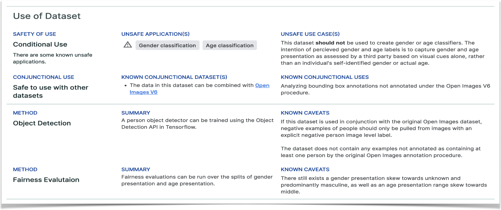
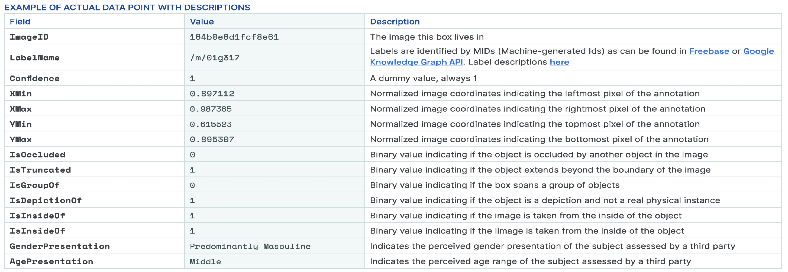
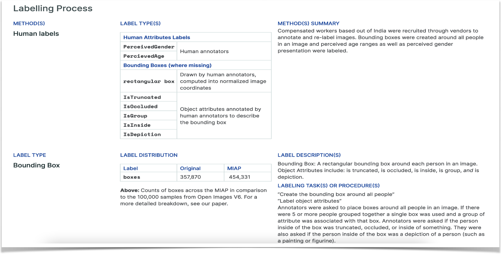
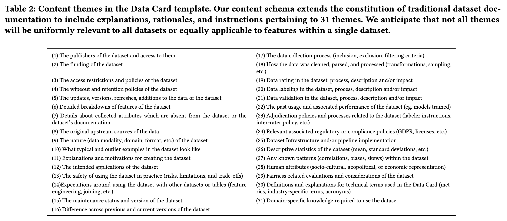
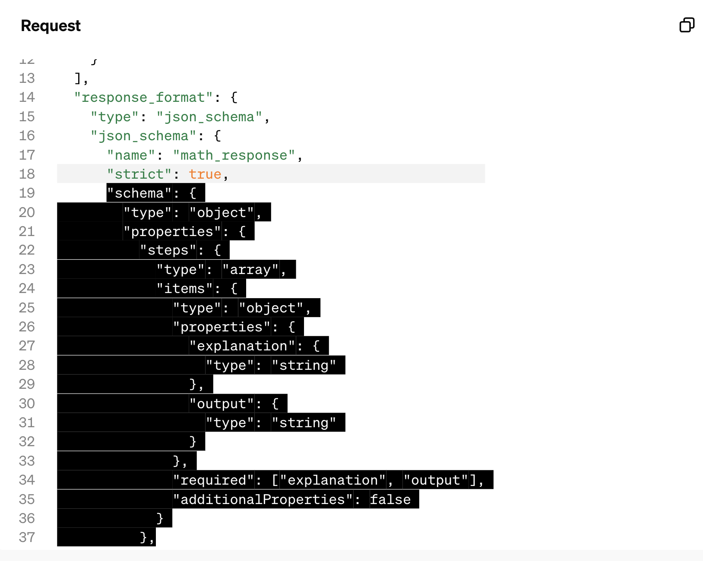
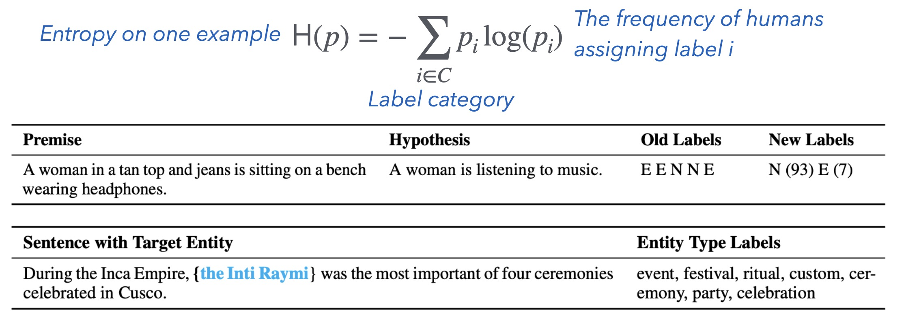
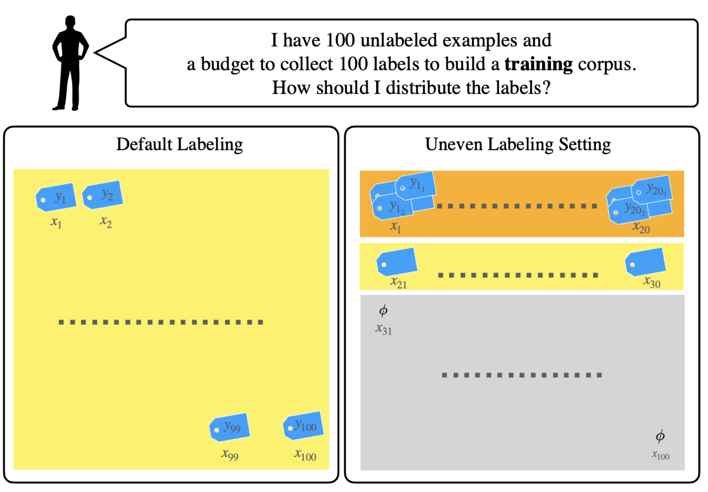
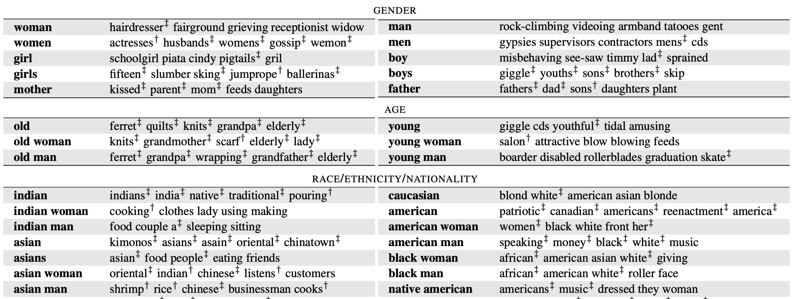
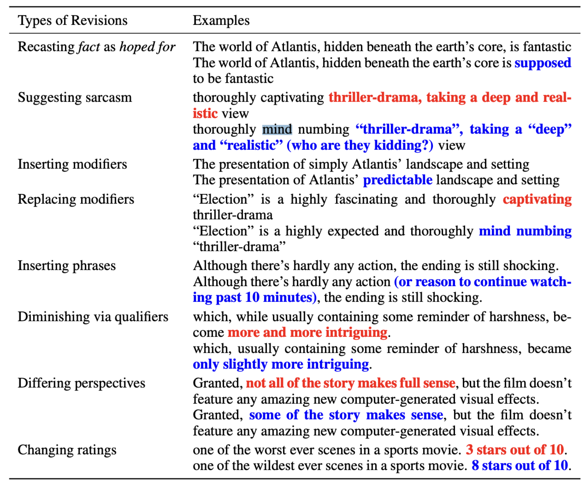
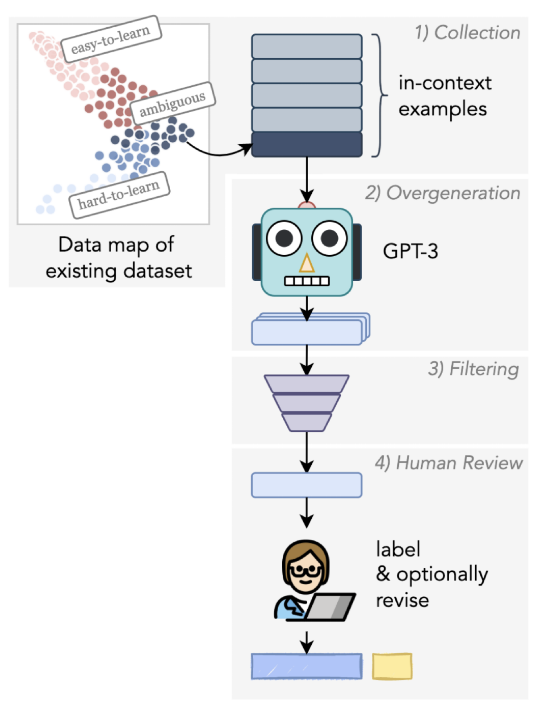

<!-- .element: class="titleslide"  data-background="../_chapterimg/12_dataquality.jpg" -->
<div class="stretch"></div>

## Machine Learning in Production


# Data Quality

<!-- image: https://pixabay.com/photos/high-level-rack-warehouse-range-408222/-->


---
# Midterm

One week from today, here


---
## More Quality Assurance...


<!-- .element: class="plain stretch" -->


----
## Readings

Required reading:
* Sambasivan, N., Kapania, S., Highfill, H., Akrong, D., Paritosh, P., & Aroyo, L. M. (2021, May). [“Everyone wants to do the model work, not the data work”: Data Cascades in High-Stakes AI](https://dl.acm.org/doi/abs/10.1145/3411764.3445518). In Proc. Conference on Human Factors in Computing Systems (pp. 1-15).


Recommended reading: 
* Schelter, S., et al. [Automating large-scale data quality verification](http://www.vldb.org/pvldb/vol11/p1781-schelter.pdf). Proceedings of the VLDB Endowment, 11(12), pp.1781-1794.


----

## Learning Goals

* Consider data quality as part of a system; design an organization that values data quality
* Distinguish precision and accuracy; understanding the better models vs more data tradeoffs
* Use schema languages to enforce data schemas
* Design and implement automated quality assurance steps that check data schema conformance and distributions 
* Devise infrastructure for detecting data drift and schema violations


---
# Poor Data Quality has Consequences

(often delayed, hard-to-fix consequences)


----
## GIGO: Garbage in, garbage out


<!-- .element: class="stretch" -->

<!-- references_ -->
Image source: https://monkeylearn.com/blog/data-cleaning-python

----
## Example: Systematic bias in labeling

Poor data quality leads to poor models

Often not detectable in offline evaluation - **Q. why not**?

Causes problems in production -  now difficult to correct


---
# Data Quality is a System-Wide Concern


<!-- .element: class="plain stretch" -->

----
## Delayed Fixes increase Repair Cost

<!-- colstart -->

Cost of bug repair depending on when the bug was introduced and fixed

* If you don't fix it early enough the cost gets higher and higher
* Same for data quality issues!

<!-- col -->


<!-- colend -->

----
## Data Cascades

"Compounding events causing negative, downstream effects from data issues, that result in technical debt over time."


<!-- references -->
Sambasivan, N., et al. (2021, May). “[Everyone wants to do the model work, not the data work”: Data Cascades in High-Stakes AI](https://dl.acm.org/doi/abs/10.1145/3411764.3445518). In Proc. CHI (pp. 1-15).


----
## Common Data Cascades

<div class="smallish">

<!-- colstart -->
**Physical world brittleness**
* Idealized data, ignoring realities and change of real-world data
* Static data, one time learning mindset, no planning for evolution

**Inadequate domain expertise**
* Not understand. data and its context
* Involving experts only late for trouble shooting

<!-- col -->
**Conflicting reward systems**
* Missing incentives for data quality
* Not recognizing data quality importance, discard as technicality
* Missing data literacy with partners

**Poor (cross-org.) documentation**
* Conflicts at team/organization boundary
* Undetected drift

<!-- colend -->
</div>

<!-- references -->
Sambasivan, N., et al. (2021). “[Everyone wants to do the model work, not the data work”: Data Cascades in High-Stakes AI](https://dl.acm.org/doi/abs/10.1145/3411764.3445518). In Proc. Conference on Human Factors in Computing Systems.

----
## Interacting with physical world brittleness

> Brittle deployments interacting with not-digitised physical worlds

<div class="small">

* **Time to manifest**: 2-3 years to emerge, almost always in the production stage
* **Impact**: Complete model failure, abandonment of projects, harms to beneficiaries from mispredictions
* **Triggers**: drifts (formally defined more later!)
  - Hardware drifts (Rain, wind, fingerprints, shadows)
  - Environmental drifts (lighting, temperature, humidity)
  - Social drifts (new regulations, new user behaviors)
* **Address**: Monitor data source, retrain models, introduce noise in data

*e.g. an AI model for the COVID-19 pandemic on day 1 versus day 100 required a total change in various assumptions since the pandemic and human responses were volatile and dynamic*
</div>


----
## Inadequate application-domain expertise

> AI practitioners are responsible for data sense-making in contexts in which they do not have domain expertise.

<div class="small">

* **Time to manifest**: After building models through client feedback & system performance
* **Impact**: Costly modification (improve labels, collect more data), Unanticipated downstream impacts
* **Triggers**:
  - Subjectivity in groundtruths (e.g. Decision history on claims of insurance companies)
  - Poor application-domain expertise in finding representative data (e.g. Cannot take 90% of the data from one hospital and generalise for the entire world!)
* **Address**: Faithfully document data sources, involve domain experts in data collection

</div>


----
## Conflicting Reward Systems

> Misaligned incentives and priorities between practitioners, domain experts, and field partners.

<div class="small">

* **Time to manifest**: Model deployment
* **Impact**: Costly iterations, moving to an alternate data source, quitting the project
* **Triggers**: Need annotation but...
  - Inserted as extraneous work
  - Not compensated well
  - Competing priority with partners’ primary responsibility
* **Address**: Provide incentives & training

*e.g., when a clinician spends a lot of time punching in data, not paying attention to the patient, that has a human cost*

</div>

----
## Poor Cross-organisational Documentation

> Lack of documentation across various cross organisational relations, causing lack of understanding on metadata

<div class="small">

* **Time to manifest**: manual reviews, by "chance"
* **Impact**: Wasted time and effort from using incorrect data, being blocked on building models, and discarding subsets or entire datasets
* **Triggers**: 
  - inherited datasets lacked critical details
  - feld partners not being aware of constraints in achieving good quality AI
* **Address**: Create a data curation plan in advance and take ample field notes in order to create reproducible assets for data

*e.g., a lack of metadata and collaborators changing schema without understanding context led to a loss of four months of precious medical robotics data collection.”*

</div>

----
## Case Study: Inventory Management


<!-- .element: class="stretch" -->

Goal: Train an ML model to predict future sales; make decisions about what to (re)stock/when/how many...

----
## Discussion: Possible Data Cascades?

* Interacting with physical world brittleness
* Inadequate domain expertise
* Conflicting reward systems
* Poor (cross-organizational) documentation


<!-- .element: class="stretch" -->


---
# Data Documentation

Let's use data documentation as an entry point to discuss what aspects of data we care about.

----
## Data flows across components


<!-- .element: class="plain stretch" -->


----
## Data Quality is a System-Wide Concern

<div class="small">

Data flows across components, e.g., from user interface into database to crowd-sourced labeling team into ML pipeline

Humans interacting with the system
* Entering data, labeling data
* Observed with sensors/telemetry
* Incentives, power structures, recognition

Organizational practices
* Value, attention, and resources given to data quality

</div>

Documentation at the interfaces is important


----
## Data Quality Documentation

<div class="smallish">

Teams rarely document expectations of data quantity or quality

Data quality tests are rare, but some teams adopt defensive monitoring
* Local tests about assumed structure and distribution of data
* Identify drift early and reach out to producing teams

Several ideas for documenting distributions, including [Datasheets](https://dl.acm.org/doi/fullHtml/10.1145/3458723) and [Dataset Nutrition Label](https://arxiv.org/abs/1805.03677)
* Mostly focused on static datasets, describing origin, consideration, labeling procedure, and distributions; [Example](https://dl.acm.org/doi/10.1145/3458723#sec-supp)

</div>

<!-- references -->
🗎 Gebru, Timnit, et al. "[Datasheets for datasets](https://dl.acm.org/doi/fullHtml/10.1145/3458723)." Communications of the ACM 64, no. 12 (2021). <br />
🗎 Nahar, Nadia, et al. “[Collaboration Challenges in Building ML-Enabled Systems: Communication, Documentation, Engineering, and Process](https://arxiv.org/abs/2110.10234).” In Pro. ICSE, 2022.

----
## Data Card

<div class="smallish">

> Data Cards are for fostering transparent, purposeful and human-centered
documentation of datasets within the practical contexts of industry and research.
> They are structured summaries of essential facts about various aspects of ML
datasets...provide explanations of processes and rationales that shape the data
and consequently the models.

<!-- .element: class="plain" -->

</div>


----
## Example Data Card (excerpt)

[](https://storage.googleapis.com/openimages/open_images_extended_miap/Open%20Images%20Extended%20-%20MIAP%20-%20Data%20Card.pdf)
<!-- .element: class="plain stretch" -->

Notes: Source: https://storage.googleapis.com/openimages/open_images_extended_miap/Open%20Images%20Extended%20-%20MIAP%20-%20Data%20Card.pdf


----
## The Dataset Creator and Purpose


----
## How to Use the Dataset



----
## Data field overview


----
## Datapoint Example



----
## Data source and collection


----
## Labeling Process



----
## Data distribution


----
## Entries in data card

Very good reference for data quality, but wayy too difficult to fill out for every dataset so usually ignored...


----
## They give you an idea of what might impact data quality

We will touch on some:

* Data quality, in terms of noise (e.g. from upstream data source, from human labelers)
* Data drifts (static dataset and its source, vs. the world now)
* Data quality, in terms of distributions (disagreements between annotators, biases towards certain distribution, annotation incentives -- tend to select easy labels, etc.)
* Data curation (shape the data towards what you want)


---
# Understand and improve data quality

Assuming you didn't have the best documented and cleaned data in the world (often!), how do you evaluate your data and how do you clean it?

----

> Data cleaning and repairing account for about 60% of the work of data scientists.

> "Everyone wants to do the model work, not the data work"

**Own experience?**

<!-- discussion -->

<!-- references -->
Quote: Gil Press. “[Cleaning Big Data: Most Time-Consuming, Least Enjoyable Data Science Task, Survey Says](https://www.forbes.com/sites/gilpress/2016/03/23/data-preparation-most-time-consuming-least-enjoyable-data-science-task-survey-says/).” Forbes Magazine, 2016.


----
## Accuracy vs Precision (on *Data*)

<!-- colstart -->

Accuracy: Reported values (on average) represent real value

Precision: Repeated measurements yield the same result

Accurate, but imprecise: **Q. How to deal with this issue?**

Inaccurate, but precise: ?

<!-- col -->


<!-- .element: style="width:400px" -->


<!-- colend -->

<!-- references_ -->
(CC-BY-4.0 by [Arbeck](https://commons.wikimedia.org/wiki/File:Accuracy_and_Precision.svg))

Note: Average to deal with noise; calibrate to deal with bias


----

## Accuracy and Precision Problems in Warehouse Data?


<!-- .element: class="stretch" -->


----
## Data Accuracy and Precision: Impact on ML

More data -> better models (up to a point, diminishing effects)

Noisy data (imprecise) -> less confident models, more data needed 
  * some ML techniques are more or less robust to noise (more on robustness in a later lecture)

Inaccurate data -> misleading models, biased models
  * Need the "right" data

**Invest in data quality, not just quantity**

---
# Dealing with noises in data 

Where do noises come from and how do we fix them?

----
## What do we mean by clean data?

- **Accuracy:** The data was recorded correctly.
- **Completeness:** All relevant data was recorded.
- **Uniqueness:** The entries are recorded once.
- **Consistency:** The data agrees with itself.
- **Timeliness:** The data is kept up to date.


----
## Challenge from collection: Data Comes from Many Sources


e.g. For the inventory system:

<svg id="mermaid1" width="100%" xmlns="http://www.w3.org/2000/svg" xmlns:xlink="http://www.w3.org/1999/xlink" height="300.4444580078125" style="max-width: 974.0121459960938px;" viewBox="0 0.0000019073486328125 974.0121459960938 300.4444580078125"><style>#mermaid1 {font-family:"trebuchet ms",verdana,arial,sans-serif;font-size:16px;fill:#333;}#mermaid1 .error-icon{fill:#552222;}#mermaid1 .error-text{fill:#552222;stroke:#552222;}#mermaid1 .edge-thickness-normal{stroke-width:2px;}#mermaid1 .edge-thickness-thick{stroke-width:3.5px;}#mermaid1 .edge-pattern-solid{stroke-dasharray:0;}#mermaid1 .edge-pattern-dashed{stroke-dasharray:3;}#mermaid1 .edge-pattern-dotted{stroke-dasharray:2;}#mermaid1 .marker{fill:#333333;stroke:#333333;}#mermaid1 .marker.cross{stroke:#333333;}#mermaid1 svg{font-family:"trebuchet ms",verdana,arial,sans-serif;font-size:16px;}#mermaid1 .label{font-family:"trebuchet ms",verdana,arial,sans-serif;color:#333;}#mermaid1 .cluster-label text{fill:#333;}#mermaid1 .cluster-label span{color:#333;}#mermaid1 .label text,#mermaid1 span{fill:#333;color:#333;}#mermaid1 .node rect,#mermaid1 .node circle,#mermaid1 .node ellipse,#mermaid1 .node polygon,#mermaid1 .node path{fill:#ECECFF;stroke:#9370DB;stroke-width:1px;}#mermaid1 .node .label{text-align:center;}#mermaid1 .node.clickable{cursor:pointer;}#mermaid1 .arrowheadPath{fill:#333333;}#mermaid1 .edgePath .path{stroke:#333333;stroke-width:2.0px;}#mermaid1 .flowchart-link{stroke:#333333;fill:none;}#mermaid1 .edgeLabel{background-color:#e8e8e8;text-align:center;}#mermaid1 .edgeLabel rect{opacity:0.5;background-color:#e8e8e8;fill:#e8e8e8;}#mermaid1 .cluster rect{fill:#ffffde;stroke:#aaaa33;stroke-width:1px;}#mermaid1 .cluster text{fill:#333;}#mermaid1 .cluster span{color:#333;}#mermaid1 div.mermaidTooltip{position:absolute;text-align:center;max-width:200px;padding:2px;font-family:"trebuchet ms",verdana,arial,sans-serif;font-size:12px;background:hsl(80, 100%, 96.2745098039%);border:1px solid #aaaa33;border-radius:2px;pointer-events:none;z-index:100;}#mermaid1 :root{--mermaid-font-family:"trebuchet ms",verdana,arial,sans-serif;}</style><g><g class="output"><g class="clusters"></g><g class="edgePaths"><g class="edgePath LS-Twitter LE-SalesTrends" style="opacity: 1;" id="L-Twitter-SalesTrends"><path class="path" d="M41.55034637451172,44.0069465637207L41.55034637451172,48.17361323038737C41.55034637451172,52.34027989705404,41.55034637451172,60.67361323038737,48.17041761636077,69.0069465637207C54.790488858209834,77.34027989705403,68.03063134190793,85.67361323038737,74.650702583757,89.84027989705403L81.27077382560604,94.0069465637207" marker-end="url(#arrowhead18)" style="fill:none"></path><defs><marker id="arrowhead18" viewBox="0 0 10 10" refX="9" refY="5" markerUnits="strokeWidth" markerWidth="8" markerHeight="6" orient="auto"><path d="M 0 0 L 10 5 L 0 10 z" class="arrowheadPath" style="stroke-width: 1; stroke-dasharray: 1, 0;"></path></marker></defs></g><g class="edgePath LS-AdNetworks LE-SalesTrends" style="opacity: 1;" id="L-AdNetworks-SalesTrends"><path class="path" d="M178.19965362548828,44.0069465637207L178.19965362548828,48.17361323038737C178.19965362548828,52.34027989705404,178.19965362548828,60.67361323038737,171.57958238363923,69.0069465637207C164.95951114179016,77.34027989705403,151.71936865809207,85.67361323038737,145.09929741624302,89.84027989705403L138.47922617439397,94.0069465637207" marker-end="url(#arrowhead19)" style="fill:none"></path><defs><marker id="arrowhead19" viewBox="0 0 10 10" refX="9" refY="5" markerUnits="strokeWidth" markerWidth="8" markerHeight="6" orient="auto"><path d="M 0 0 L 10 5 L 0 10 z" class="arrowheadPath" style="stroke-width: 1; stroke-dasharray: 1, 0;"></path></marker></defs></g><g class="edgePath LS-SalesTrends LE-Prediction" style="opacity: 1;" id="L-SalesTrends-Prediction"><path class="path" d="M109.875,130.0138931274414L109.875,134.18055979410806C109.875,138.34722646077475,109.875,146.68055979410806,166.44622099680836,162.49383973114013C223.0174419936167,178.3071196681722,336.1598839872334,201.600346208903,392.7311049840417,213.24695947926838L449.30232598085007,224.8935727496338" marker-end="url(#arrowhead20)" style="fill:none"></path><defs><marker id="arrowhead20" viewBox="0 0 10 10" refX="9" refY="5" markerUnits="strokeWidth" markerWidth="8" markerHeight="6" orient="auto"><path d="M 0 0 L 10 5 L 0 10 z" class="arrowheadPath" style="stroke-width: 1; stroke-dasharray: 1, 0;"></path></marker></defs></g><g class="edgePath LS-VendorSales LE-Prediction" style="opacity: 1;" id="L-VendorSales-Prediction"><path class="path" d="M269.80555725097656,130.0138931274414L269.80555725097656,134.18055979410806C269.80555725097656,138.34722646077475,269.80555725097656,146.68055979410806,300.0449251591014,161.31758370019978C330.28429306722626,175.9546076062915,390.76302888347595,196.89532208514163,421.0023967916008,207.36567932456668L451.24176469972565,217.83603656399174" marker-end="url(#arrowhead21)" style="fill:none"></path><defs><marker id="arrowhead21" viewBox="0 0 10 10" refX="9" refY="5" markerUnits="strokeWidth" markerWidth="8" markerHeight="6" orient="auto"><path d="M 0 0 L 10 5 L 0 10 z" class="arrowheadPath" style="stroke-width: 1; stroke-dasharray: 1, 0;"></path></marker></defs></g><g class="edgePath LS-ProductData LE-Prediction" style="opacity: 1;" id="L-ProductData-Prediction"><path class="path" d="M429.5885467529297,130.0138931274414L429.5885467529297,134.18055979410806C429.5885467529297,138.34722646077475,429.5885467529297,146.68055979410806,435.70485924925265,157.49039096221438C441.82117174557567,168.30022213032066,454.0537967382217,181.58655113319992,460.17010923454467,188.22971563463955L466.28642173086763,194.87288013607917" marker-end="url(#arrowhead22)" style="fill:none"></path><defs><marker id="arrowhead22" viewBox="0 0 10 10" refX="9" refY="5" markerUnits="strokeWidth" markerWidth="8" markerHeight="6" orient="auto"><path d="M 0 0 L 10 5 L 0 10 z" class="arrowheadPath" style="stroke-width: 1; stroke-dasharray: 1, 0;"></path></marker></defs></g><g class="edgePath LS-Marketing LE-Prediction" style="opacity: 1;" id="L-Marketing-Prediction"><path class="path" d="M579.1371612548828,130.0138931274414L579.1371612548828,134.18055979410806C579.1371612548828,138.34722646077475,579.1371612548828,146.68055979410806,573.0208487585599,157.49039096221438C566.9045362622369,168.30022213032066,554.6719112695909,181.58655113319992,548.5555987732679,188.22971563463955L542.4392862769449,194.87288013607917" marker-end="url(#arrowhead23)" style="fill:none"></path><defs><marker id="arrowhead23" viewBox="0 0 10 10" refX="9" refY="5" markerUnits="strokeWidth" markerWidth="8" markerHeight="6" orient="auto"><path d="M 0 0 L 10 5 L 0 10 z" class="arrowheadPath" style="stroke-width: 1; stroke-dasharray: 1, 0;"></path></marker></defs></g><g class="edgePath LS-Theft LE-Prediction" style="opacity: 1;" id="L-Theft-Prediction"><path class="path" d="M749.1284828186035,130.0138931274414L749.1284828186035,134.18055979410806C749.1284828186035,138.34722646077475,749.1284828186035,146.68055979410806,717.2266872301142,161.43250851168727C685.324891641625,176.18445722926649,621.5213004646463,197.3550213310915,589.619504876157,207.94030338200403L557.7177092876676,218.52558543291656" marker-end="url(#arrowhead24)" style="fill:none"></path><defs><marker id="arrowhead24" viewBox="0 0 10 10" refX="9" refY="5" markerUnits="strokeWidth" markerWidth="8" markerHeight="6" orient="auto"><path d="M 0 0 L 10 5 L 0 10 z" class="arrowheadPath" style="stroke-width: 1; stroke-dasharray: 1, 0;"></path></marker></defs></g><g class="edgePath LS-PastSales LE-Prediction" style="opacity: 1;" id="L-PastSales-Prediction"><path class="path" d="M920.0139007568359,130.0138931274414L920.0139007568359,134.18055979410806C920.0139007568359,138.34722646077475,920.0139007568359,146.68055979410806,859.9340521287166,162.58640451464422C799.8542035005972,178.49224923518037,679.6945062443584,201.97060534291936,619.6146576162391,213.70978339678882L559.5348089881197,225.44896145065835" marker-end="url(#arrowhead25)" style="fill:none"></path><defs><marker id="arrowhead25" viewBox="0 0 10 10" refX="9" refY="5" markerUnits="strokeWidth" markerWidth="8" markerHeight="6" orient="auto"><path d="M 0 0 L 10 5 L 0 10 z" class="arrowheadPath" style="stroke-width: 1; stroke-dasharray: 1, 0;"></path></marker></defs></g></g><g class="edgeLabels"><g class="edgeLabel" style="opacity: 1;" transform=""><g transform="translate(0,0)" class="label"><rect rx="0" ry="0" width="0" height="0"></rect><foreignObject width="0" height="0"><div xmlns="http://www.w3.org/1999/xhtml" style="display: inline-block; white-space: nowrap;"><span id="L-L-Twitter-SalesTrends" class="edgeLabel L-LS-Twitter' L-LE-SalesTrends"></span></div></foreignObject></g></g><g class="edgeLabel" style="opacity: 1;" transform=""><g transform="translate(0,0)" class="label"><rect rx="0" ry="0" width="0" height="0"></rect><foreignObject width="0" height="0"><div xmlns="http://www.w3.org/1999/xhtml" style="display: inline-block; white-space: nowrap;"><span id="L-L-AdNetworks-SalesTrends" class="edgeLabel L-LS-AdNetworks' L-LE-SalesTrends"></span></div></foreignObject></g></g><g class="edgeLabel" style="opacity: 1;" transform=""><g transform="translate(0,0)" class="label"><rect rx="0" ry="0" width="0" height="0"></rect><foreignObject width="0" height="0"><div xmlns="http://www.w3.org/1999/xhtml" style="display: inline-block; white-space: nowrap;"><span id="L-L-SalesTrends-Prediction" class="edgeLabel L-LS-SalesTrends' L-LE-Prediction"></span></div></foreignObject></g></g><g class="edgeLabel" style="opacity: 1;" transform=""><g transform="translate(0,0)" class="label"><rect rx="0" ry="0" width="0" height="0"></rect><foreignObject width="0" height="0"><div xmlns="http://www.w3.org/1999/xhtml" style="display: inline-block; white-space: nowrap;"><span id="L-L-VendorSales-Prediction" class="edgeLabel L-LS-VendorSales' L-LE-Prediction"></span></div></foreignObject></g></g><g class="edgeLabel" style="opacity: 1;" transform=""><g transform="translate(0,0)" class="label"><rect rx="0" ry="0" width="0" height="0"></rect><foreignObject width="0" height="0"><div xmlns="http://www.w3.org/1999/xhtml" style="display: inline-block; white-space: nowrap;"><span id="L-L-ProductData-Prediction" class="edgeLabel L-LS-ProductData' L-LE-Prediction"></span></div></foreignObject></g></g><g class="edgeLabel" style="opacity: 1;" transform=""><g transform="translate(0,0)" class="label"><rect rx="0" ry="0" width="0" height="0"></rect><foreignObject width="0" height="0"><div xmlns="http://www.w3.org/1999/xhtml" style="display: inline-block; white-space: nowrap;"><span id="L-L-Marketing-Prediction" class="edgeLabel L-LS-Marketing' L-LE-Prediction"></span></div></foreignObject></g></g><g class="edgeLabel" style="opacity: 1;" transform=""><g transform="translate(0,0)" class="label"><rect rx="0" ry="0" width="0" height="0"></rect><foreignObject width="0" height="0"><div xmlns="http://www.w3.org/1999/xhtml" style="display: inline-block; white-space: nowrap;"><span id="L-L-Theft-Prediction" class="edgeLabel L-LS-Theft' L-LE-Prediction"></span></div></foreignObject></g></g><g class="edgeLabel" style="opacity: 1;" transform=""><g transform="translate(0,0)" class="label"><rect rx="0" ry="0" width="0" height="0"></rect><foreignObject width="0" height="0"><div xmlns="http://www.w3.org/1999/xhtml" style="display: inline-block; white-space: nowrap;"><span id="L-L-PastSales-Prediction" class="edgeLabel L-LS-PastSales' L-LE-Prediction"></span></div></foreignObject></g></g></g><g class="nodes"><g class="node default" style="opacity: 1;" id="flowchart-Twitter-16" transform="translate(41.55034637451172,26.00347328186035)"><rect rx="0" ry="0" x="-33.55034828186035" y="-18.003472328186035" width="67.1006965637207" height="36.00694465637207" class="label-container"></rect><g class="label" transform="translate(0,0)"><g transform="translate(-23.55034828186035,-8.003472328186035)"><foreignObject width="47.1006965637207" height="16.00694465637207"><div xmlns="http://www.w3.org/1999/xhtml" style="display: inline-block; white-space: nowrap;">Twitter</div></foreignObject></g></g></g><g class="node default" style="opacity: 1;" id="flowchart-SalesTrends-17" transform="translate(109.875,112.01041984558105)"><rect rx="0" ry="0" x="-54.59201431274414" y="-18.003472328186035" width="109.18402862548828" height="36.00694465637207" class="label-container"></rect><g class="label" transform="translate(0,0)"><g transform="translate(-44.59201431274414,-8.003472328186035)"><foreignObject width="89.18402862548828" height="16.00694465637207"><div xmlns="http://www.w3.org/1999/xhtml" style="display: inline-block; white-space: nowrap;">SalesTrends</div></foreignObject></g></g></g><g class="node default" style="opacity: 1;" id="flowchart-AdNetworks-18" transform="translate(178.19965362548828,26.00347328186035)"><rect rx="0" ry="0" x="-53.098960876464844" y="-18.003472328186035" width="106.19792175292969" height="36.00694465637207" class="label-container"></rect><g class="label" transform="translate(0,0)"><g transform="translate(-43.098960876464844,-8.003472328186035)"><foreignObject width="86.19792175292969" height="16.00694465637207"><div xmlns="http://www.w3.org/1999/xhtml" style="display: inline-block; white-space: nowrap;">AdNetworks</div></foreignObject></g></g></g><g class="node default" style="opacity: 1;" id="flowchart-Prediction-21" transform="translate(504.36285400390625,236.2291717529297)"><circle x="-56.21527862548828" y="-18.003472328186035" r="56.21527862548828" class="label-container"></circle><g class="label" transform="translate(0,0)"><g transform="translate(-46.21527862548828,-8.003472328186035)"><foreignObject width="92.43055725097656" height="16.00694465637207"><div xmlns="http://www.w3.org/1999/xhtml" style="display: inline-block; white-space: nowrap;">Inventory ML</div></foreignObject></g></g></g><g class="node default" style="opacity: 1;" id="flowchart-VendorSales-22" transform="translate(269.80555725097656,112.01041984558105)"><rect rx="0" ry="0" x="-55.33854293823242" y="-18.003472328186035" width="110.67708587646484" height="36.00694465637207" class="label-container"></rect><g class="label" transform="translate(0,0)"><g transform="translate(-45.33854293823242,-8.003472328186035)"><foreignObject width="90.67708587646484" height="16.00694465637207"><div xmlns="http://www.w3.org/1999/xhtml" style="display: inline-block; white-space: nowrap;">VendorSales</div></foreignObject></g></g></g><g class="node default" style="opacity: 1;" id="flowchart-ProductData-24" transform="translate(429.5885467529297,112.01041984558105)"><rect rx="0" ry="0" x="-54.4444465637207" y="-18.003472328186035" width="108.8888931274414" height="36.00694465637207" class="label-container"></rect><g class="label" transform="translate(0,0)"><g transform="translate(-44.4444465637207,-8.003472328186035)"><foreignObject width="88.8888931274414" height="16.00694465637207"><div xmlns="http://www.w3.org/1999/xhtml" style="display: inline-block; white-space: nowrap;">ProductData</div></foreignObject></g></g></g><g class="node default" style="opacity: 1;" id="flowchart-Marketing-26" transform="translate(579.1371612548828,112.01041984558105)"><rect rx="0" ry="0" x="-45.10416793823242" y="-18.003472328186035" width="90.20833587646484" height="36.00694465637207" class="label-container"></rect><g class="label" transform="translate(0,0)"><g transform="translate(-35.10416793823242,-8.003472328186035)"><foreignObject width="70.20833587646484" height="16.00694465637207"><div xmlns="http://www.w3.org/1999/xhtml" style="display: inline-block; white-space: nowrap;">Marketing</div></foreignObject></g></g></g><g class="node default" style="opacity: 1;" id="flowchart-Theft-28" transform="translate(749.1284828186035,112.01041984558105)"><rect rx="0" ry="0" x="-74.88715362548828" y="-18.003472328186035" width="149.77430725097656" height="36.00694465637207" class="label-container"></rect><g class="label" transform="translate(0,0)"><g transform="translate(-64.88715362548828,-8.003472328186035)"><foreignObject width="129.77430725097656" height="16.00694465637207"><div xmlns="http://www.w3.org/1999/xhtml" style="display: inline-block; white-space: nowrap;">Expired/Lost/Theft</div></foreignObject></g></g></g><g class="node default" style="opacity: 1;" id="flowchart-PastSales-30" transform="translate(920.0139007568359,112.01041984558105)"><rect rx="0" ry="0" x="-45.99826431274414" y="-18.003472328186035" width="91.99652862548828" height="36.00694465637207" class="label-container"></rect><g class="label" transform="translate(0,0)"><g transform="translate(-35.99826431274414,-8.003472328186035)"><foreignObject width="71.99652862548828" height="16.00694465637207"><div xmlns="http://www.w3.org/1999/xhtml" style="display: inline-block; white-space: nowrap;">PastSales</div></foreignObject></g></g></g></g></g></g></svg>


----
## Challenge from collection: Data Comes from Many Sources

- Manually entered
- Generated through actions in IT systems
- Logging information, traces of user interactions
- Sensor data
- Crowdsourced 

*These sources have different reliability and quality*


----
## What happens: Data is noisy

Wrong results and computations, crashes

Duplicate data, near-duplicate data

Out of order data

Data format invalid

**Examples in inventory system?**


----

## Two levels of data precision

1. **Data Integrety / Schema**: Ensuring basic consistency about shape and types
2. **Wrong and inconsistent data**: Application- and domain-specific data issues

----
# Data Integrety / Schema
Ensuring basic consistency about shape and types


----
## Data Schema

Define the expected format of data
  * expected fields and their types
  * expected ranges for values
  * constraints among values (within and across sources)

Data can be automatically checked against schema

Protects against change; explicit interface between components


----
## Data Schema Constraints for Inventory System?

<div class="small">

Product Database:

| ID | Name | Weight | Description | Size | Vendor |
| - |  - |  - |  - |  - | - | 
| ... |  ... |  ... |  ... |  ... |  ... | 

Stock:

| ProductID | Location | Quantity |
| - |  - |  - |
| ... |  ... |  ... |

Sales history:

| UserID | ProductId | DateTime | Quantity | Price | 
| - |  - |  - | - |- |
| ... |  ... |  ... |... |... |

</div>


----
## Schema Problems: Uniqueness, data format, integrity, ...

* Illegal attribute values: `bdate=30.13.70`
* Violated attribute dependencies: `age=22, bdate=12.02.70`
* Uniqueness violation: `(name=”John Smith”, SSN=”123456”), (name=”Peter Miller”, SSN=”123456”)`
* Referential integrity violation: `emp=(name=”John Smith”, deptno=127)` if department 127 not defined

<!-- references -->

Further readings: Rahm, Erhard, and Hong Hai Do. [Data cleaning: Problems and current approaches](http://dc-pubs.dbs.uni-leipzig.de/files/Rahm2000DataCleaningProblemsand.pdf). IEEE Data Eng. Bull. 23.4 (2000): 3-13.


----
## Schema in Relational Databases

```sql
CREATE TABLE employees (
    emp_no      INT             NOT NULL,
    birth_date  DATE            NOT NULL,
    name        VARCHAR(30)     NOT NULL,
    PRIMARY KEY (emp_no));
CREATE TABLE departments (
    dept_no     CHAR(4)         NOT NULL,
    dept_name   VARCHAR(40)     NOT NULL,
    PRIMARY KEY (dept_no), UNIQUE  KEY (dept_name));
CREATE TABLE dept_manager (
   dept_no      CHAR(4)         NOT NULL,
   emp_no       INT             NOT NULL,
   FOREIGN KEY (emp_no)  REFERENCES employees (emp_no),
   FOREIGN KEY (dept_no) REFERENCES departments (dept_no),
   PRIMARY KEY (emp_no,dept_no)); 
```


----
## Dirty Data: Example


<!-- .element: class="plain" -->

*Problems with this data?*
*Which Problems are Schema Problems?*


----
## What Happens When New Data Violates Schema?

<!-- discussion -->


----
##  Modern Databases: Schema-Less

<!-- colstart -->


<!-- .element: class="plain" -->

<!-- col -->

Also vector databases, schema-aware databases that bascially store long text in each cell, etc.

<!-- colend -->

<!-- references_ -->
Image source: https://www.kdnuggets.com/2021/05/nosql-know-it-all-compendium.html

----
## Schema-Less Data Exchange

* CSV files
* Key-value stores (JSon, XML, Nosql databases)
* Message brokers
* REST API calls
* R/Pandas Dataframes

```
2022-10-06T01:31:18,230550,GET /rate/narc+2002=4
2022-10-06T01:31:19,332644,GET /rate/i+am+love+2009=4
```

```json
{"user_id":5,"age":26,"occupation":"scientist","gender":"M"}
```

----
## Schema-Less Data Exchange

**Q. Benefits? Drawbacks?**

----
## Schema Library: Apache Avro

```json
{   "type": "record",
    "namespace": "com.example",
    "name": "Customer",
    "fields": [{
            "name": "first_name",
            "type": "string",
            "doc": "First Name of Customer"
        },        
        {
            "name": "age",
            "type": "int",
            "doc": "Age at the time of registration"
        }
    ]
}
```

----
## Schema Library: Apache Avro

<div class="smallish">

<!-- colstart -->

Schema specification in JSON format

Serialization and deserialization with automated checking

Native support in Kafka

<!-- col -->

Benefits
  * Serialization in space efficient format
  * APIs for most languages (ORM-like)
  * Versioning constraints on schemas

Drawbacks
  * Reading/writing overhead
  * Binary data format, extra tools needed for reading
  * Requires external schema and maintenance
  * Learning overhead

<!-- colend -->

</div>

Notes: Further readings eg https://medium.com/@stephane.maarek/introduction-to-schemas-in-apache-kafka-with-the-confluent-schema-registry-3bf55e401321, https://www.confluent.io/blog/avro-kafka-data/, https://avro.apache.org/docs/current/

----
## Many Schema Libraries/Formats

Examples
* Avro
* XML Schema
* Protobuf
* Thrift
* Parquet
* ORC


----
## Schema not just for database but for data transmission

<!-- colstart -->


<!-- col -->


<!-- colend -->

<!-- references -->
https://openai.com/index/introducing-structured-outputs-in-the-api/

----
## Summary: Schema 

Basic structure and type definition of data

Well supported in databases and many tools

*Very low bar of data quality*


----
# Wrong and Inconsistent Data

Application- and domain-specific data issues

----
## Dirty Data: Example


<!-- .element: class="plain" -->

*Problems with the data beyond schema problems?*


----
## Wrong and Inconsistent Data


* Missing values: `phone=9999-999999`
* Misspellings: `city=Pittsburg`
* Misfielded values: `city=USA`
* Duplicate records: `name=John Smith, name=J. Smith`
* Wrong reference: `emp=(name=”John Smith”, deptno=127)` if department 127 defined but wrong

**Q. How can we detect and fix these problems?**


<!-- references -->

Further readings: Rahm, Erhard, and Hong Hai Do. [Data cleaning: Problems and current approaches](http://dc-pubs.dbs.uni-leipzig.de/files/Rahm2000DataCleaningProblemsand.pdf). IEEE Data Eng. Bull. 23.4 (2000): 3-13.


----
## Discussion: Wrong and Inconsistent Data?


<!-- .element: class="stretch" -->


----
## Data Cleaning Overview

Data analysis / Error detection
  * Usually focused on specific kind of problems, e.g., duplication, typos, missing values, distribution shift
  * Detection in input data vs detection in later stages (more context)

Error repair
  * Repair data vs repair rules, one at a time or holistic
  * Data transformation or mapping
  * Automated vs human guided

----
## Error Detection Examples

Illegal values: min, max, variance, deviations, cardinality

Misspelling: sorting + manual inspection, dictionary lookup

Missing values: null values, default values

Duplication: sorting, edit distance, normalization


----
## Example Tool: Great Expectations

```python
expect_column_values_to_be_between(
    column="passenger_count",
    min_value=1,
    max_value=6
)
```

Supports schema validation and custom instance-level checks.

<!-- references -->
https://greatexpectations.io/


----
## Example Tool: Great Expectations


<!-- .element: class="stretch" -->


<!-- references_ -->
https://greatexpectations.io/


----
## Rule-based detection: Data Quality Rules

*Rules can be used to reject data or repair it*


<div class="smallish">

**Invariants on data that must hold**

**Typically about relationships of multiple attributes or data sources, eg.**
  - ZIP code and city name should correspond
  - User ID should refer to existing user
  - SSN should be unique
  - For two people in the same state, the person with the lower income should not have the higher tax rate

**Classic integrity constraints in databases or conditional constraints**

</div>


----
## ML-based for Detecting Inconsistencies


<!-- .element: class="plain stretch" -->

<!-- references_ -->
Image source: Theo Rekatsinas, Ihab Ilyas, and Chris Ré, “[HoloClean - Weakly Supervised Data Repairing](https://dawn.cs.stanford.edu/2017/05/12/holoclean/).” Blog, 2017.

----
## Example: HoloClean


<div class="small">

* User provides rules as integrity constraints (e.g., "two entries with the same
name can't have different city")
* Detect violations of the rules in the data; also detect statistical outliers
* Automatically generate repair candidates (with probabilities)
</div>


<!-- .element: class="stretch" -->

<!-- references_ -->
Image source: Theo Rekatsinas, Ihab Ilyas, and Chris Ré, “[HoloClean - Weakly Supervised Data Repairing](https://dawn.cs.stanford.edu/2017/05/12/holoclean/).” Blog, 2017.

----
## Discovery of Data Quality Rules

<div class="small">

  <!-- colstart -->

Rules directly taken from external databases
  * e.g. zip code directory

Given clean data, 
  * several algorithms that find functional relationships ($X\Rightarrow Y$) among columns
  * algorithms that find conditional relationships (if $Z$ then $X\Rightarrow Y$)
  * algorithms that find denial constraints ($X$ and $Y$ cannot co-occur in a row)

<!-- col -->
Given mostly clean data (probabilistic view),
  * algorithms to find likely rules (e.g., association rule mining)
  * outlier and anomaly detection

Given labeled dirty data or user feedback,
  * supervised and active learning to learn and revise rules
  * supervised learning to learn repairs (e.g., spell checking)
<!-- colend -->
</div>

<!-- references -->

Further reading: Ilyas, Ihab F., and Xu Chu. [Data cleaning](https://dl.acm.org/doi/book/10.1145/3310205). Morgan & Claypool, 2019.


----
## Discussion: Data Quality Rules 


<!-- .element: class="stretch" -->
 
Note: Compare with past price


---
# Dealing with Drift

*Why does my model begin to perform poorly over time?*

A very particular form of data accuracy problem (data becomes wrong), caused not by human creators but by the world. Very prevalent & affects product so we talk about it first!

<!-- ---- -->
<!-- ## Monitoring for Changes -->

<!--  -->
<!-- <\!-- .element: class="stretch" -\-> -->

<!-- <\!-- references_ -\-> -->

<!-- https://www.anomalo.com/ -->


----
## Data changes

System objective changes over time

Software components are upgraded or replaced

Prediction models change

Quality of supplied data changes

User behavior changes

Assumptions about the environment no longer hold

**Examples in inventory system?**


----
## Users may deliberately change data

Users react to model output; causes data shift

Users try to game/deceive the model

**Examples in inventory system?**

----
## Types of Drift


<!-- .element: class="stretch" -->

<!-- references_ -->
Gama et al., *A survey on concept drift adaptation*. ACM Computing Surveys Vol. 46, Issue 4 (2014)

----

## Drift & Model Decay

<div class="small">

**Concept drift** (or concept shift)
  * properties to predict change over time (e.g., what is credit card fraud)
  * model has not learned the relevant concepts
  * over time: different expected outputs for same inputs
  
**Data drift** (or covariate shift, virtual drift, distribution shift, or population drift)
  * characteristics of input data changes (e.g., customers with face masks)
  * input data differs from training data 
  * over time: predictions less confident, further from training data

**Upstream data changes**
  * external changes in data pipeline (e.g., format changes in weather service)
  * model interprets input data incorrectly
  * over time: abrupt changes due to faulty inputs

**How do we fix these drifts?**

</div>
Notes:
  * fix1: retrain with new training data or relabeled old training data
  * fix2: retrain with new data
  * fix3: fix pipeline, retrain entirely

----
## On Terminology

Concept and data drift are separate concepts

In practice and literature not always clearly distinguished

Colloquially encompasses all forms of model degradations and environment changes

Define term for target audience


<!-- .element: class="cornerimg" -->


----
## Last AIV Warning for Breakouts

From the first lecture and syllabus:

> Within groups, we expect that you are honest about your contribution to the group's work. [...] This also applies to in-class discussions, where indicating working with others who did not participate in the discussion is considered an academic honesty violation.

----
## Breakout: Drift in the Inventory System

*What kind of drift might be expected?*

As a group, tagging members, write plausible examples in `#lecture`:

> * Concept Drift:
> * Data Drift:
> * Upstream data changes:


<!-- .element: class="stretch" -->


----
## Watch for Degradation in Prediction Accuracy


<!-- .element: class="stretch plain" -->


----
## Indicators of Concept Drift

*How to detect concept drift in production?*

<!-- discussion -->

----
## Indicators of Concept Drift

Model degradations observed with telemetry

Telemetry indicates different outputs over time for similar inputs

Differences in influential features and feature importance over time

Relabeling training data changes labels

Interpretable ML models indicate rules that no longer fit

*(many papers on this topic, typically on statistical detection)*

----
## Indicators of Data Drift

*How to detect data drift in production?*

<!-- discussion -->

----
## Indicators of Data Drift

Model degradations observed with telemetry

Distance between input distribution and training distribution increases

Average confidence of model predictions declines

Relabeling of training data retains stable labels


----
## Detecting Data Drift

* Compare distributions over time (e.g., t-test)
* Detect both sudden jumps and gradual changes
* Distributions can be manually specified or learned (see invariant detection)

<!-- colstart -->

<!-- col -->

<!-- colend -->


----
## Data Distribution Analysis

Plot distributions of features (histograms, density plots, kernel density estimation)
  - Identify which features drift

Define distance function between inputs and identify distance to closest training data (e.g., energy distance, see also kNN)

Anomaly detection and "out of distribution" detection

Compare distribution of output labels

----
## Data Distribution Analysis Example

https://rpubs.com/ablythe/520912


----
## Microsoft Azure Data Drift Dashboard


<!-- references -->
Image source and further readings: [Detect data drift (preview) on models deployed to Azure Kubernetes Service (AKS)](https://docs.microsoft.com/en-us/azure/machine-learning/how-to-monitor-datasets?tabs=python)


----
## Dealing with Drift

Regularly retrain model on recent data
  - Use evaluation in production to detect decaying model performance

Involve humans when increasing inconsistencies detected
  - Monitoring thresholds, automation

Monitoring, monitoring, monitoring!


---
# Dealing with Inaccurate Data not caused by drifts

How do you detect and fix more systematic data quality issues?

*Slightly more advanced topic but you might find it fun*


----
## Challenge from collection and processing: Biased

<!-- colstart -->

<div class="smallish">

The concept of "raw data" might be misleading; Data is always some proxy we actively collect to represent the world. Someone decides...
* What data to collect
* How to collect them
* What scale to use

They change what you can do with the data

</div>

<!-- col -->


<!-- .element: class="stretch" -->

<!-- colend -->

<!-- references_ -->
Recommended Reading: Gitelman, Lisa, Virginia Jackson, Daniel Rosenberg, Travis D. Williams, Kevin R. Brine, Mary Poovey, Matthew Stanley et al. "[Data bite man: The work of sustaining a long-term study](https://ieeexplore.ieee.org/abstract/document/6462156)." In "Raw Data" Is an Oxymoron, (2013), MIT Press: 147-166.


----
## What happens: Data is inaccurate (for what you want to do)

Missing data

Biased data

Systematic errors in data distribution

**Examples in inventory system?**


----
## Data Quality from a Utility Perspective

<!-- .element: class="plain" style="width:900px" -->

<!-- references_ -->
Rogers, Anna, et al. "Changing the World by Changing the Data" ACL 2021


----
## Task Subjectiveness & Disagreement 

<div class="small">

If you have datasets with a wide range of raw labels, you can quantify task subjectiveness using **entropy**: a measure for the level of uncertainty or agreement among human judgements, where high entropy suggests low level of agreement and vice versa.

<!-- .element: class="plain" -->

</div>

----
## Task Subjectiveness & Disagreement 

<div class="small">

If you have datasets with a wide range of raw labels, you can quantify task subjectiveness using **entropy**: a measure for the level of uncertainty or agreement among human judgements, where high entropy suggests low level of agreement and vice versa.

<!-- .element: class="plain" -->

</div>
 
<!-- references_ -->
Zhang, Shujian, Chengyue Gong, and Eunsol Choi. "Learning with different amounts of annotation: From zero to many labels." EMNLP 2021
Choi, Eunsol, et al. "Ultra-fine entity typing." ACL 2018 

----
## Mitigation on Disagreement


<!-- colstart -->


Core idea: Use annotation disagreement to decide whether to relabel existing examples, or label completely new examples.

Allow data points to have multiple labels; Also train with these multiple labels.

Clear gains on some NLP tasks!

<!-- col -->



<!-- colend -->


<!-- references_ -->
Zhang, Shujian, Chengyue Gong, and Eunsol Choi. "Learning with different amounts of annotation: From zero to many labels." EMNLP 2021


----
## Annotation artifact

Unwanted patterns or biases present in the data, which can cause language models to make incorrect predictions.

e.g. For Natural Language Inference Task (Premise, Hypothesis, Label)

Models can do moderately well on NLI datasets without looking at the premise!


----
## One way to detect annotation artifact

Pointwise Mutual Information (PMI) is a statistical measure of the association between two variables X and Y. It captures the strength of the relationship between the two variables and expresses it as a numerical score.

$$PMI(feature,class) = \log \frac{P(feature,class)}{P(feature, \cdot)P(class, \cdot)}$$

*In more plain language: “how frequent do a feature and a class co-occure? How easy it is to detect a class just by looking at a feature?''*

----
## Social Bias through PMI



<!-- references_ -->
Rudinger, Rachel, Chandler May, and Benjamin Van Durme. "Social bias in elicited natural language inferences." EthNLP 2017.

----
## Mitigation of Annotation Artifact

<!-- colstart -->

**Counterfactual Data Augmentation**

Core idea: Minimally editing existing examples to maintain the label.

Make models more stable on examples that are very similar.

<!-- col -->



<!-- colend -->

<!-- references_ -->
Kaushik, Divyansh, et al. "Learning the difference that makes a difference with counterfactually augmented data." ICLR 2020.


----
## Dataset Difficulty: Data Map 


<!-- colstart -->

<div class="small">

Not all examples contribute equally to model training. 

During training, instances that a model always predicts correctly are different from those it almost never does, or those on which it vacillates.


</div>

<!-- col -->


<!-- colend -->

<!-- references_ -->
Swayamdipta, Swabha, et al. "Dataset cartography: Mapping and diagnosing datasets with training dynamics." EMNLP 2020


----
## Dataset Difficulty: Data Map 


<!-- colstart -->

<div class="small">

Core idea: Construct model-dependent data map based on training dynamics (the behavior of a model as training progresses).
Divide datasets into slices of easy-to learn, ambiguous and hard-to-learn.

Actually using the data accuracy vs. data precision idea!

Benefit: Diagnose and split datasets in the context of model training.
- Find data points useful for particular cases. 
- Measure uncertainty.
- Detect mislabeled samples. 

</div>

<!-- col -->


<!-- colend -->

<!-- references_ -->
Swayamdipta, Swabha, et al. "Dataset cartography: Mapping and diagnosing datasets with training dynamics." EMNLP 2020


----
## Mitigation on Dataset Difficulty


<!-- colstart -->

<div class="small">

Core idea: Use data map to find useful input patterns, use LLMs to generate more of these patterns.

Make dataset more interesting and useful.


```text
Selected different example:
P: 5% probability that each part is defect free. 
H: Each part has a 95% chance of having a defect

Mimicked output:
P: 1% of the seats were vacant. 
H: 99% of the seats were occupied.
```

</div>

<!-- col -->


<!-- .element: class="plain" style="width: 350px" -->

<!-- colend -->


<!-- references_ -->
Zhang, Shujian, Chengyue Gong, and Eunsol Choi. "Learning with different amounts of annotation: From zero to many labels." EMNLP 2021

----
## Key takeaways

Data curation takes a lot of forms, but essentially they just want to improve the dataset on some of the measurements we mentioned. 

So essentially,
* Pick data points that are relevant to the metric;
* Decide whether you want to use the data point in a different way;
* Decide whether you want to make some changes to the data.


---
# Summary

* Data quality is a system-level concern
  * Data quality at the interface between components
  * Documentation and monitoring often poor
  * Involves organizational structures, incentives, ethics, ...
* Data from many sources, often inaccurate, imprecise, inconsistent, incomplete, ... -- many different forms of data quality problems 
* Many mechanisms for enforcing consistency and cleaning 
  * Data schema ensures format consistency
  * Data quality rules ensure invariants across data points
* Concept and data drift are key challenges -- monitor


----
## Further Readings

<div class="smaller">

* Schelter, S., Lange, D., Schmidt, P., Celikel, M., Biessmann, F. and Grafberger, A., 2018. Automating large-scale data quality verification. Proceedings of the VLDB Endowment, 11(12), pp.1781-1794.
* Polyzotis, Neoklis, Martin Zinkevich, Sudip Roy, Eric Breck, and Steven Whang. "Data validation for machine learning." Proceedings of Machine Learning and Systems 1 (2019): 334-347.
* Polyzotis, Neoklis, Sudip Roy, Steven Euijong Whang, and Martin Zinkevich. 2017. “Data Management Challenges in Production Machine Learning.” In Proceedings of the 2017 ACM International Conference on Management of Data, 1723–26. ACM.
* Theo Rekatsinas, Ihab Ilyas, and Chris Ré, “HoloClean - Weakly Supervised Data Repairing.” Blog, 2017.
* Ilyas, Ihab F., and Xu Chu. Data cleaning. Morgan & Claypool, 2019.
* Moreno-Torres, Jose G., Troy Raeder, Rocío Alaiz-Rodríguez, Nitesh V. Chawla, and Francisco Herrera. "A unifying view on dataset shift in classification." Pattern recognition 45, no. 1 (2012): 521-530.
* Vogelsang, Andreas, and Markus Borg. "Requirements Engineering for Machine Learning: Perspectives from Data Scientists." In Proc. of the 6th International Workshop on Artificial Intelligence for Requirements Engineering (AIRE), 2019.
* Humbatova, Nargiz, Gunel Jahangirova, Gabriele Bavota, Vincenzo Riccio, Andrea Stocco, and Paolo Tonella. "Taxonomy of real faults in deep learning systems." In Proceedings of the ACM/IEEE 42nd International Conference on Software Engineering, pp. 1110-1121. 2020.


</div>
